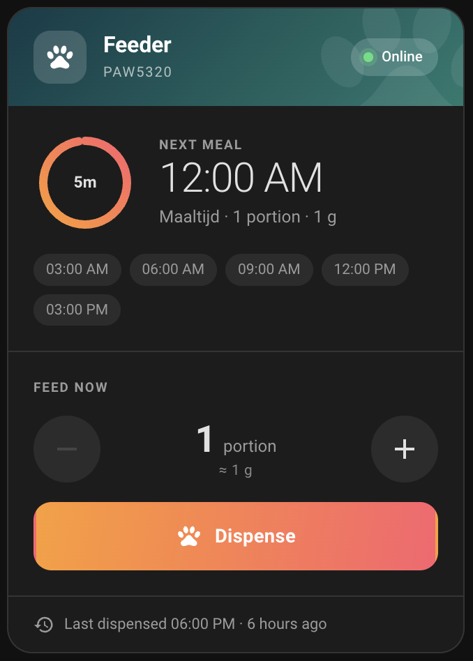

# Philips Pet Series for Home Assistant

Bring your **Philips Pet Series** smart feeder into
[Home Assistant](https://www.home-assistant.io/). Feed the cat from a dashboard
button, use the meal schedule in your automations, watch the live camera, and
get told when the food is running low.

Signing in takes an email address and a code. That is the whole setup. The
feeder, its sensors and the camera video are all configured for you.

## What you can do with it

**Feeding.** A feed-now button, portion size, the portion used for scheduled
meals, and the full meal schedule as a Home Assistant calendar. You can read the
next meal from an automation, or dispense a portion when you are out and running
late.

**The camera.** Live video and audio, plus the most recent motion snapshot as
the still image. It works straight away. There is no camera URL to hunt down and
nothing to copy across from another app.

**Camera settings.** Privacy mode, night vision, motion detection, image flip,
on-screen display, anti-flicker, siren and volume, all as entities. The card
surfaces the four you reach for; the rest live on the device page.

**Knowing what is going on.** Online and offline status, food level, feeding
faults, the filter-replacement reminder, and firmware versions. Recent events
such as motion, meals and faults arrive as sensors you can trigger automations
from.

## Supported devices

Philips Pet Series feeders in the PAW range, including the **PAW5320** smart
feeder with camera. Feeders without a camera work too. You simply get the
feeding and sensor side.

If you have a Pet Series device that is not picked up, please
[open an issue](https://github.com/AboveColin/HA-Philips-Pet-Series/issues) and
say which model you have. Adding one is usually a small change.

## Before you start

You need Home Assistant with [HACS](https://hacs.xyz/) installed, and your
feeder already set up in the Philips Pet Series app on a Philips or home.id
account. If it is not paired yet, do that in the app first.

## Installing

The integration is in the default HACS store, so there is no custom repository
to add.

1. Open **HACS** in Home Assistant.
2. Search for **Philips Pet Series**.
3. Select it, choose **Download**, then restart Home Assistant.

[](https://my.home-assistant.io/redirect/hacs_repository/?owner=AboveColin&repository=HA-Philips-Pet-Series&category=integration)

If you would rather do it by hand, copy `custom_components/philips_pet_series`
into your Home Assistant `config/custom_components/` directory and restart.

## Signing in

1. Go to **Settings**, then **Devices & Services**, then **Add Integration**,
   and search for **Philips Pet Series**.
2. Enter the email address of your Philips or home.id account.
3. Philips emails you a one-time code. Type it in.

Every home and supported device on the account is added automatically. Your
login is kept fresh in the background, so you should not need to do this again.
If it ever does expire, Home Assistant shows a **Reconfigure** prompt that asks
for a new code.

## A note about the camera

The feeder only allows a couple of camera connections at once, and holding one
open permanently can push the Philips app off. So by default the integration
connects only while something is actually watching, and lets go afterwards.

That suits normal dashboard use. If you want a recorder pulling the stream
around the clock, switch **Camera streaming** to **Always on** in the
integration options, and expect the phone app to lose live view while it runs.

Recording in Frigate, go2rtc or a similar NVR is covered in
**[docs/nvr.md](docs/nvr.md)**, including which settings to change first and
what each option costs you in CPU.

## The dashboard cards

The integration ships three Lovelace cards and registers them for you, so there
is no second HACS download and no resource to add by hand. After installing,
search the card picker for **Philips**.

| Card | For |
| --- | --- |
| **Philips Pet Series feeder** | The next meal and feeding by hand |
| **Philips Pet Series camera** | The picture, and the privacy and motion switches |
| **Philips Pet Series health** | Connection, firmware and anything needing attention |

They share one look, one set of sizes and one set of colour settings, so a
dashboard built from all three reads as one thing.



### The feeder card

A ring counts down to the next scheduled meal, filling as the wait goes on, with
the time and what will be served next to it. Below that are the rest of the
day's feeding times, a portion stepper with the weight worked out from the
feeder's own portion size, a dispense button, any active food or filter problem,
and when the feeder last dispensed. An unreachable feeder fades its header, so
you can see it across the room.

The card looks its entities up through the integration rather than by name, so
renaming an entity does not break your dashboard.

#### Settings

Everything is in the visual editor, grouped into **Feeding**, **Sections** and
**Appearance**, with a live preview beside it. The same options in YAML:

```yaml
type: custom:philips-feeder-card
device_id: 2487611038fe2be6d9b0e1afe71a6014 # pick this in the card editor
name: Kitchen feeder
```

| Option | Default | What it does |
| --- | --- | --- |
| `device_id` | *required* | Which feeder the card is for |
| `name` | the device name | Title in the header |
| `confirm` | `false` | Require a second tap before dispensing |
| `default_portions` | `1` | How many portions the stepper starts on |
| `max_portions` | the feeder's own limit | Lowers the stepper's ceiling. It can only ever lower it, so a dashboard cannot ask the feeder for more than it accepts |
| `show_next_meal` | `true` | The next-meal section |
| `show_ring` | `true` | The countdown ring. With it off, the time to go is shown beside the clock instead |
| `show_schedule` | `true` | The rest of the day's feeding times |
| `show_feed` | `true` | The stepper and dispense button |
| `show_problems` | `true` | Food and filter warnings |
| `show_last_dispensed` | `true` | The footer |
| `layout` | `full` | How much room the card takes. See below |
| `animations` | `true` | Motion. See below |

### Sizes

Every card comes in several sizes, so it fits a wide desktop column or a single
cell of a sections grid. Denser sizes drop decoration, never numbers. Each card
offers only the sizes it actually implements: `tile` is the feeder card's, since
it is the only one whose job fits on one line.

| `layout` | Roughly | What it is |
| --- | --- | --- |
| `full` | 6 rows | Everything, roomy. The model line and the paw watermark are on |
| `compact` | 5 rows | Same content, tighter, no watermark or model line |
| `slim` | 3 rows | Smaller ring and clock, and the stepper sits on the same row as the dispense button |
| `tile` | 1 row | One line: name, countdown, a warning icon if something is wrong, and a round dispense button. Tapping the rest opens more info |

The card reports these sizes to Home Assistant, so it takes sensible space in a
sections view without you resizing it by hand, and you can still stretch or
shrink it from the card's own resize handle.

At `tile` size a stepper would be unusable, so its button dispenses whatever
`default_portions` is set to. `confirm` still applies.

Mix the size with the section toggles for the shape you want. A slim card with
nothing but the next meal and the controls:

```yaml
type: custom:philips-feeder-card
device_id: 2487611038fe2be6d9b0e1afe71a6014
layout: slim
show_schedule: false
show_last_dispensed: false
```

A row of feeders for a wall tablet, glance only:

```yaml
type: custom:philips-feeder-card
device_id: 2487611038fe2be6d9b0e1afe71a6014
layout: tile
show_feed: false
```

### Motion

The card moves a little, and only where the movement says something:

- The card fades up as it arrives, and the feeding times arrive left to right
  in the order you read them.
- The countdown ring draws itself once on the first paint, then eases between
  values rather than jumping.
- The portion count springs when you change it, so a tap registers even if you
  are not looking straight at the number.
- The dispense button sweeps while the command is in flight, then confirms with
  a tick and a hop of the paw. An offline status dot pulses. A button waiting
  for your confirming tap breathes.

Nothing loops for the sake of it: a healthy feeder sitting idle is completely
still.

Turn it off with the **Animations** switch in any of the cards' editors, or
`animations: false`.
If your device or browser is set to reduce motion, the card honours that and
stays still whatever this option says.

### The camera card

The feeder's live picture, with round toggles for the switches the camera has:
privacy mode, motion detection, the pre-feeding snapshot and the on-screen
display. With privacy mode on, the frame says so rather than leaving you to
interpret a black rectangle.

```yaml
type: custom:philips-camera-card
device_id: 2487611038fe2be6d9b0e1afe71a6014
camera_view: live # or: auto
```

| Option | Default | What it does |
| --- | --- | --- |
| `camera_view` | `live` | `live` streams while you are looking at the card, and shows a **LIVE** badge. The integration lets the connection go when nothing is watching, but the feeder only allows a couple at once, so a live view can push the phone app off meanwhile. `auto` shows the periodically refreshed still instead and leaves the feeder alone |
| `show_picture` | `true` | The picture |
| `show_controls` | `true` | The row of camera switches |
| `show_last_motion` | `true` | The footer. With it off, the last motion moves onto the picture instead |

Sizes: `full`, `compact`, `slim`. Slim also narrows the picture to 21:9.

### The health card

Everything about the feeder that is not feeding: whether anything needs
attention, then the readouts worth having at a glance, then any maintenance
button the feeder offers.

The warning strip is always honest in both directions. When nothing is wrong it
says so, rather than showing an empty space you have to interpret as good news.
Tiles only appear for what your feeder actually reports, so a feeder with no
filter has no filter row.

```yaml
type: custom:philips-health-card
device_id: 2487611038fe2be6d9b0e1afe71a6014
```

| Option | Default | What it does |
| --- | --- | --- |
| `show_problems` | `true` | The warning strip |
| `show_stats` | `true` | Cloud, firmware, portion size and feeding fault |
| `show_actions` | `true` | Maintenance buttons, currently **Reset filter** |

Sizes: `full`, `compact`, `slim`.

### Making it yours

The cards have their own look rather than borrowing Home Assistant's, so a
dashboard tells you at a glance which cards are the feeder's. The settings
below apply to all three.

The header and accent gradients have colour pickers in the **Appearance**
section of the editor. If you would rather set them once for every card, they
are CSS variables you can put in your own theme:

| Variable | Default | What it colours |
| --- | --- | --- |
| `--pps-hero-start` / `--pps-hero-end` | `#0e3b47` / `#1f7a6f` | The header gradient |
| `--pps-accent-start` / `--pps-accent-end` | `#ff9d2f` / `#ff5f6d` | The dispense button and the countdown ring |
| `--pps-accent` | `#ff8347` | The confirmation outline |
| `--pps-online-color` / `--pps-offline-color` | `#4ade80` / `#f87171` | The status dot |
| `--pps-card-radius` | `18px` | Corner rounding |

Everything else follows your theme's own text, divider and error colours, so the
cards read correctly in light and dark without any configuration.

If your Lovelace runs in YAML mode, Home Assistant owns the resource list, so
add the resource yourself. The exact line to add is written to the log at
startup.

## Documentation

Full guides covering installation, day to day use, every entity, automation
examples and troubleshooting live in the
**[wiki](https://github.com/AboveColin/HA-Philips-Pet-Series/wiki)**.

## Getting help

Something not working, or a device not recognised? Open an
[issue](https://github.com/AboveColin/HA-Philips-Pet-Series/issues). For
questions, ideas and showing off what you have automated, there is
[Discussions](https://github.com/AboveColin/HA-Philips-Pet-Series/discussions).

This is an independent community project. It is not made, backed or supported by
Philips or Versuni.

## Contributing

Pull requests are welcome. If you are planning something substantial, open an
issue first so we can talk it through.

## License

MIT.
